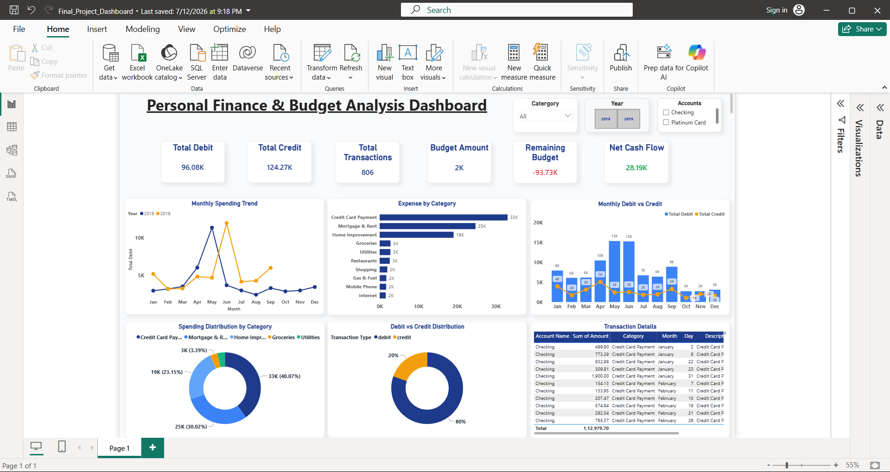

# 📊 Finance Analytics Dashboard

## 📌 Project Overview

This project is an interactive **Finance Analytics Dashboard** created using **Microsoft Power BI**.
The dashboard helps analyze financial transactions, income, expenses, budget, and monthly financial performance.

## 🛠️ Tools & Technologies

* Microsoft Power BI
* Microsoft Excel
* Data Visualization
* Data Analysis
* DAX

## 📈 Dashboard Features

* 💰 Total Income
* 💸 Total Expenses
* 📊 Budget vs Actual Analysis
* 📅 Monthly Debit & Credit Analysis
* 🏷️ Expense by Category
* 📌 Budget Utilization
* 🔎 Interactive Filters and Slicers

## 📊 Dashboard Preview

## 📂 Project Structure

Finance-Analytics-Dashboard/
│
├── Dataset/
│   └── finance_data.xlsx
│
├── Screenshots/
│   └── finance-dashboard.png
│
├── Finance_Dashboard.pbix
│
└── README.md

## 💡 Key Insights

The dashboard provides a clear overview of financial performance and helps identify spending patterns, budget utilization, and changes in income and expenses over time.

## 🎯 Objective

The main objective of this project is to transform raw financial data into an interactive and easy-to-understand dashboard for better financial analysis and decision-making.

## 👩‍💻 Author

**Kalpna Singh**

Computer Science Engineering Student
